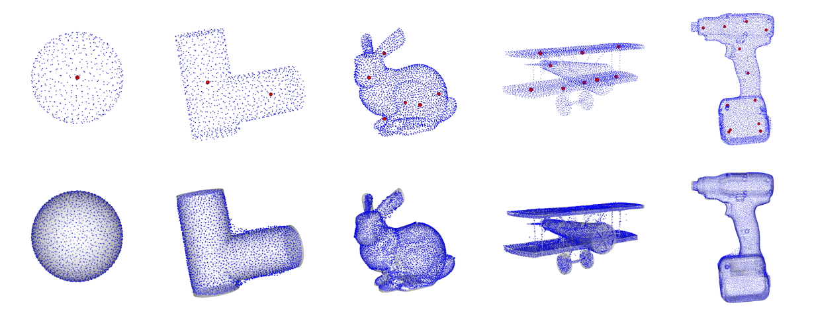
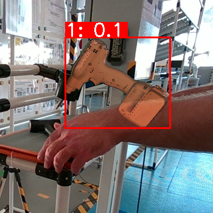
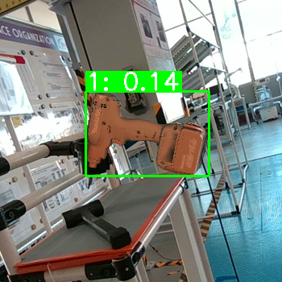
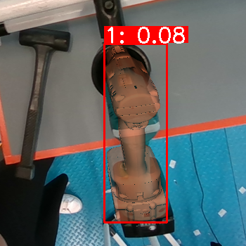

# COBRA - COnfidence score Based on shape Regression Analysis for method-independent quality assesment of object pose estimation from single images

[Project page](link) | [arXiv](link)




<p align="center">
  
   
  
</p>

## Table of Contents

- Installation / Environment setup
- Train COBRA in custom objects
- Evaluation of trained model
- Score estimated poses


## Installation

- Clone the repository and setup the conda environment:
```
git clone https://github.com/pansap99/COBRA.git
cd COBRA
conda env create -f environment.yml
```
- Install the pose visualization toolkit by downloading the wheel file inside the ```vis``` directory:

```
cd vis
pip install pose_vis-1.0-py3-none-any.whl
```
This package utilizes OpenGL to render the estimated poses and overlay them into the images, together with their derived confidence.


## Train COBRA in custom objects

To train COBRA to represent a custom object you will need its 3D model in a ply format. You can either use ray-casting to sample points on the surface of the object or Poisson sampling. You can accomplish this by running (for Poisson sampling replace `method=ray-casting` with `method=poisson`):

```
python sample_points.py \
    --modelPath=./models/original/ \
    --savePath=./models/train/ \
    --method=ray-casting \
    --num_points_poisson=10000 \
    --random_seed=42
```

Now you can train COBRA by running:

```
python train.py \
    --model_3d=model \
    --num_ref_points=8 \
    --overlap=0.05 \
    --vis_overlap \
    --vis
```

where ```model``` is the name of the model inside the ./models/train folder, ```num_ref_points``` are the number of reference points (see paper), ```overlap``` is the percentage of overlapping regions while ```vis_overlap``` visualizes overlaping regions before starting the training.

After the training is complete a folder named ```./results/model``` will be created with the above structure:

```
model_name
    │   kmeans.pkl
    │   kmeans_centers.txt
    │   training_points_per_class.txt
    |   pcd_vis.png
    │
    └───gps
            0.pkl.gz
            1.pkl.gz
            2.pkl.gz
            3.pkl.gz
```

## Evaluation of trained model

Again, using the script ```sample_points.py``` you can produce test points by changing the random seed.
Then, you can run:

```
python infer.py --model_3d=model_name --vis
```
where this time **model_name** is the name of the model inside the ```./models/test``` folder. This script will visualize the predicted points and print the evaluation metrics, as shown below.

```
Eval metrics
┏━━━━━━━━━━━━━━━━━━━━━┳━━━━━━━━━━━━━━━━━━━━━┳━━━━━━━━━━━━━━━━━━━━━┳━━━━━━━━━━━━━━━━━━━━━┓
┃ CD                  ┃ Mean pd             ┃ Median pd           ┃ Std pd              ┃
┡━━━━━━━━━━━━━━━━━━━━━╇━━━━━━━━━━━━━━━━━━━━━╇━━━━━━━━━━━━━━━━━━━━━╇━━━━━━━━━━━━━━━━━━━━━┩
│ 0.07903112722019581 │ 0.07888972217363736 │ 0.06921322491031852 │ 0.05524255244358641 │
└─────────────────────┴─────────────────────┴─────────────────────┴─────────────────────┘
```
where **CD** is the chamfer distance, and **pd** denotes the pairwise-distance.

## Method independent pose estimation scoring


**NOTE**: You can find pre-generated data in the designated folders.

To score pre-computed estimated poses with COBRA you will need to provide a file in .csv format that contains 2D-3D correspodences and the confidence output of your estimator. An example of the structure of the file can be seen below:

```
inlier,x,y,X,Y,Z,conf
1.0,534.0,166.0,73.149,114.048,10.581,0.138
1.0,534.0,166.0,75.803,108.941,19.653,0.235
1.0,538.0,166.0,75.970,112.339,7.050,0.278
```

Please follow the above structure of your data under the ```./scoring``` directory:

```
├── scoring
│   ├── corrs
│   │   ├── 11_corr.txt
│   │   ├── 23_corr.txt
│   │   └── 8_corr.txt
│   ├── est_poses.json
│   ├── images
│   │   ├── 000008.png
│   │   ├── 000011.png
│   │   └── 000023.png
│   ├── K.txt
│   └── vis
│       ├── 11.png
│       ├── 23.png
│       └── 8.png

```
where:
- **images** directory contains the RGB images of your object
- **corrs** directory contains a csv file for each image/pose (as described above)
- **K.txt** contains the calibration matrix of the camera used to acquire the images (and estimate the poses)
- **vis** is the output folder where the visualization will be saved

Finally, run:
```
python score_poses.py \                                                                     
    --model_3d=obj_000001 \
    --sigma_hat=1.93 \
    --delta=2
```
where additionally:
- `est_poses.json` is a JSON file containing the estimated 6D poses
- `sigma_hat` is the pd std (for details see evaluation section)


