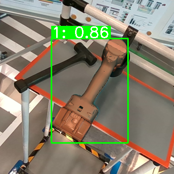

# COBRA - COnfidence score Based on shape Regression Analysis for method-independent quality assessment of object pose estimation from single images

<!--Project page](link)-->
**[arXiv](https://arxiv.org/abs/2404.16471)**

[Panagiotis Sapoutzoglou<sup>1,2</sup>](https://www.linkedin.com/in/panagiotis-sapoutzoglou-66984a201/), [Georgios Giapitzakis Tzintanos<sup>1</sup>](https://github.com/giorgosgiapis), [George
Terzakis<sup>2</sup>](https://github.com/terzakig), [Maria Pateraki<sup>1,2</sup>](http://www.mpateraki.org/)

[<sup>1</sup>National Technical University of Athens](https://ntua.gr/en/), Athens, Greece <br>
[<sup>2</sup>Institute of Communication & Computer Systems](https://www.iccs.gr/en/), Athens, Greece


<p align="center">
    
    
     
    
</p>

## Abstract

We present a generic algorithm for scoring pose estimation methods that rely on single image semantic analysis. The algorithm employs a lightweight putative shape representation using a combination of multiple Gaussian Processes. Each Gaussian Process (GP) yields distance normal distributions from multiple reference points in the object's coordinate system to its surface, thus providing a geometric evaluation framework for scoring predicted poses. Our confidence measure comprises the average mixture probability of pixel back-projections onto the shape template. In the reported experiments, we compare the accuracy of our GP based representation of objects versus the actual geometric models and demonstrate the ability of our method to capture the influence of outliers as opposed to the corresponding intrinsic measures that ship with the segmentation and pose estimation methods.

## Overview

The core functionality of this repo can be summarized in five steps:
- Installation: Set up the Conda environment and install dependencies using the provided instructions.
- Sample points from a 3D model to serve as the training and test sets. This is done by utilizing the script ```sample_points.py```.
- Train COBRA to represent the shape of the object. This is done by running the ```train.py``` script.
- Evaluate the trained model over test points and compute accuracy metrics (```infer.py```).
- Use the trained model to score estimated poses pre-computed from an independent pose estimation algorithm (```score_poses.py```).

## Table of Contents

- [Installation / Environment setup](#installation)
- [Train COBRA for custom objects](#train-cobra-for-custom-objects)
- [Evaluation of trained model](#evaluation-of-trained-model)
- [Score estimated poses](#method-independent-pose-estimation-scoring)


## Installation

- Clone the repository and setup the conda environment:
```
git clone https://github.com/pansap99/COBRA.git
cd COBRA
conda env create -f environment.yml
```
- Install the pose visualization toolkit by downloading the wheel file inside the ```vis``` directory:

```
cd vis
pip install pose_vis-1.0-py3-none-any.whl
```
This package utilizes OpenGL to render the estimated poses and overlay them into the images, together with their derived confidence.

**NOTE**: If you encounter an error similar to this one: ```libGL error: MESA-LOADER: failed to open iris``` you can try to resolve it by running :
```export LD_PRELOAD=/usr/lib/x86_64-linux-gnu/libstdc++.so.6```

## Train COBRA for custom objects

### Sample training/test points

To train COBRA to represent a custom object you will need its 3D model in a ply format. You can either use ray-casting to sample points on the surface of the object or Poisson sampling:

- If you select ```ray-casting``` as the sampling method you must also provide the arguments:
```
python sample_points.py \
    --modelPath=./models/original/ \
    --split=train \
    --method=ray-casting \
    --num_ref_points=8 \
    --step=3.0
```
which represent the number of reference points to in ray-casting to increase coverage of the objects surface and step is the angular step to create rays from the reference points.
- If you select ```poisson``` as your sampling method you have to provide the arguments:
```
python sample_points.py \
    --modelPath=./models/original/ \
    --split=train \
    --method=ray-casting \
    --num_points_poisson=10000 \
    --random_seed=42
```

where the ```num_points_poisson``` is the target number of sampled points and ```random_seed``` is used for randomization.

### Training
Finally, you can train COBRA by running:

```
python train.py \
    --model_3d=model \
    --num_ref_points=8 \
    --overlap=0.05 \
    --vis_overlap
```

where ```model``` is the name of the model inside the `./models/train` folder, ```num_ref_points``` is the number of reference points (see paper), ```overlap``` is the percentage of overlapping regions while ```vis_overlap``` visualizes overlaping regions before starting the training.

After the training is complete a folder named ```./results/model``` will be created with the below structure:

```
model_name
    │   kmeans.pkl
    │   kmeans_centers.txt
    │   training_points_per_class.txt
    |   pcd_vis.png
    │
    └───gps
            0.pkl.gz
            1.pkl.gz
            2.pkl.gz
            3.pkl.gz
```

## Evaluation of trained model

Again, using the script ```sample_points.py``` you can produce test points by changing the random seed.
Then, you can run:

```
python infer.py --model_3d=model_name --vis
```
where this time **model_name** is the name of the model inside the ```./models/test``` folder. This script will visualize the predicted points and print the evaluation metrics, as shown below.

```
Eval metrics
┏━━━━━━━━━━━━━━━━━━━━━┳━━━━━━━━━━━━━━━━━━━━━┳━━━━━━━━━━━━━━━━━━━━━┳━━━━━━━━━━━━━━━━━━━━━┓
┃ CD                  ┃ Mean pd             ┃ Median pd           ┃ Std pd              ┃
┡━━━━━━━━━━━━━━━━━━━━━╇━━━━━━━━━━━━━━━━━━━━━╇━━━━━━━━━━━━━━━━━━━━━╇━━━━━━━━━━━━━━━━━━━━━┩
│ 0.07903112722019581 │ 0.07888972217363736 │ 0.06921322491031852 │ 0.05524255244358641 │
└─────────────────────┴─────────────────────┴─────────────────────┴─────────────────────┘
```
where **CD** is the chamfer distance, and **pd** denotes the pairwise-distance.

## Method independent pose estimation scoring


**NOTE**: You can find pre-generated data in the designated folders.

To score pre-computed estimated poses with COBRA you will need to provide a file in .csv format that contains 2D-3D correspodences and the confidence output of your estimator. An example of the structure of the file can be seen below:

```
inlier,x,y,X,Y,Z,conf
1.0,534.0,166.0,73.149,114.048,10.581,0.138
1.0,534.0,166.0,75.803,108.941,19.653,0.235
1.0,538.0,166.0,75.970,112.339,7.050,0.278
```

Please follow the above structure of your data under the ```./scoring``` directory:

```
├── scoring
│   ├── corrs
│   │   ├── 11_corr.txt
│   │   ├── 23_corr.txt
│   │   └── 8_corr.txt
│   ├── est_poses.json
│   ├── images
│   │   ├── 000008.png
│   │   ├── 000011.png
│   │   └── 000023.png
│   ├── K.txt
│   └── vis
│       ├── 11.png
│       ├── 23.png
│       └── 8.png

```
where:
- **images** directory contains the RGB images of your object
- **corrs** directory contains a csv file for each image/pose (as described above)
- **K.txt** contains the calibration matrix of the camera used to acquire the images (and estimate the poses)
- **vis** is the output folder where the visualization will be saved

Finally, run:
```
python score_poses.py \                                                                     
    --model_3d=obj_000001 \
    --sigma_hat=1.93 \
    --delta=2
```
where additionally:
- `est_poses.json` is a JSON file containing the estimated 6D poses
- `sigma_hat` is the pd std (for details see evaluation section)


